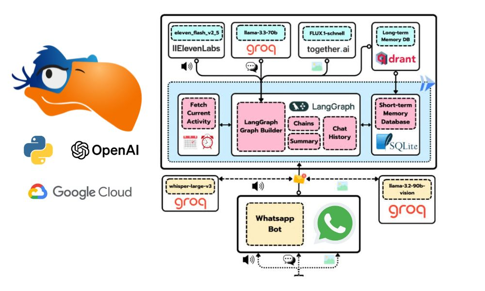

# Zazu AI Assistant

> Think of it as a modern reinterpretation of the Turing Test 🤣

Welcome to the **Zazu AI Assistant** course! By the end of this course, you'll have built your own Zazu, capable of:

✅ Sending and receiving WhatsApp messages 📲  
✅ Understanding your voice commands 🗣️  
✅ Recognizing and processing images 🖼️  
✅ Sending voice notes back 🎤  
✅ Sharing updates about its daily activities 🚣  
✅ Sending you images of its current activities 🖼️

Excited? Let’s get started! 🚀

---

## The tech stack

<table>
  <tr>
    <th>Technology</th>
    <th>Description</th>
  </tr>
  <tr>
    <td></td>
    <td>Powering the project with Llama 3.3, Llama 3.2 Vision, and Whisper. Groq models are awesome (and fast!!)</td>
  </tr>
  <tr>
    <td></td>
    <td>Serving as the long-term database, enabling our agent to recall details you shared months ago.</td>
  </tr>
  <tr>
    <td></td>
    <td>Deploying your containers easily to Google Cloud Platform</td>
  </tr>
  <tr>
    <td></td>
    <td>Learn how to build production-ready LangGraph workflows</td>
  </tr>
  <tr>
    <td></td>
    <td>Amazing TTS models</td>
  </tr>
  <tr>
    <td></td>
    <td>Behind Zazu's image generation process</td>
  </tr>
</table>

---

## 📚 Course Outline

This course consists of **six structured lessons**, each with a written and video version. We recommend going through both for an optimal learning experience. Make sure to check the Before We Start section to get everything set up.

### 🛠️ Lesson 0: Before We Begin

📅 **Date:** _Before starting_

- This project requires several tools and services. Follow the setup instructions in this document to prepare.

### 🕸️ Lesson 1: Zazu's Brain is Just a Graph

📅 **Date:** _2025-02-12_

> Work in Progress... 👷

### 🧠 Lesson 2: Unlocking Zazu's Memories

📅 **Date:** _2025-02-19_

> Work in Progress... 👷

### 🗣️ Lesson 3: Giving Zazu a Voice

📅 **Date:** _2025-02-26_

> Work in Progress... 👷

### 👀 Lesson 4: Zazu Learns to See

📅 **Date:** _2025-03-05_

> Work in Progress... 👷

### 📱 Lesson 5: Zazu Installs WhatsApp

📅 **Date:** _2025-03-12_

> Work in Progress... 👷

---

## 📝 License

This project is licensed under the **MIT License**. See the LICENSE file for more details.
