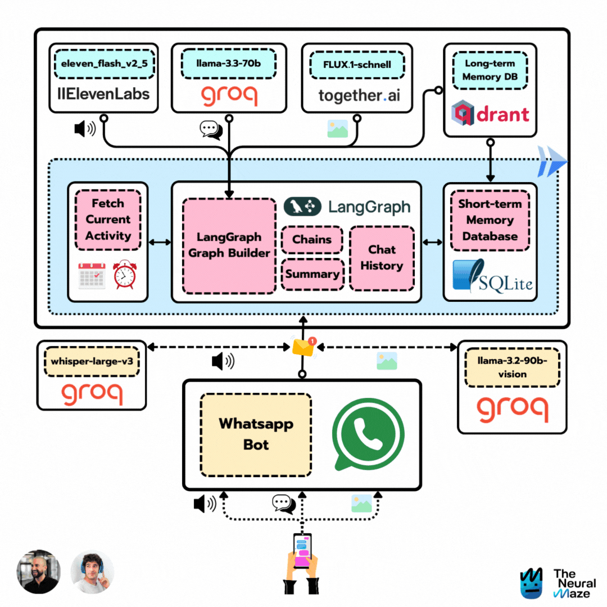
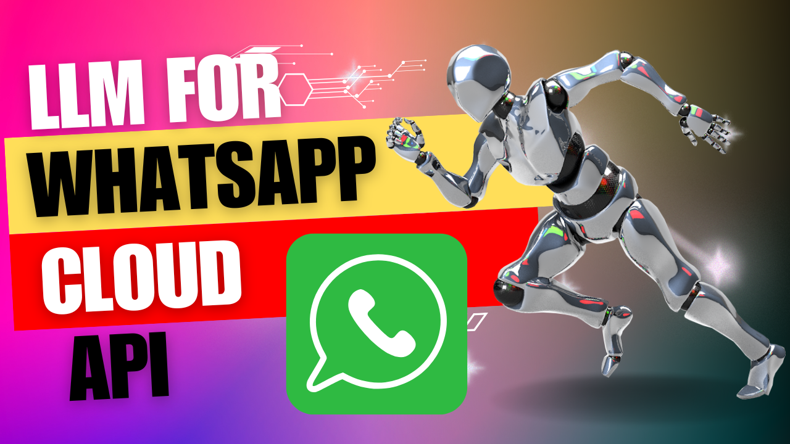
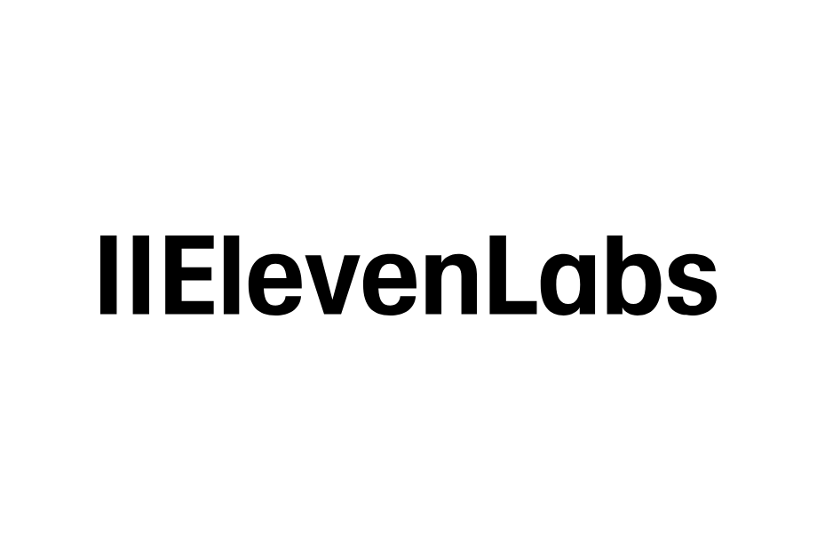
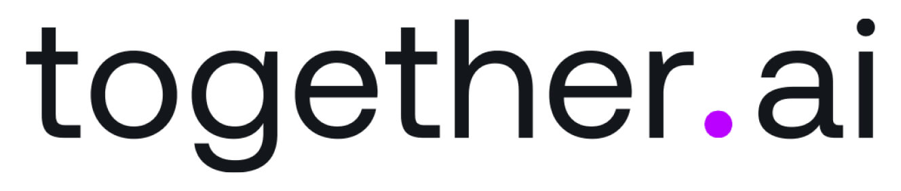

        
    <h1 align="center">📱 Zazu 📱</h1>
    <h3 align="center">Turning the Turing Test into a Whatsapp Agent</h3>

    

## Course Overview

    

What happens when [two ML Engineers](#contributors) with a love for sci-fi movies team up? 🤔

> You can think of it as a modern reinterpretation of the Turing Test 🤣

By the end of this course, you'll have built your own Zazu too, capable of:

- Receiving and sending Whatsapp messages 📲
- Understanding your voice 🗣️
- Recognizing your images 🖼️
- Sending voice notes back 🎤
- Sharing updates about its "daily activities" 🚣
- Sending you images of its current activities 🖼️

Excited? Let's get started!

## The tech stack

<table>
  <tr>
    <th>Technology</th>
    <th>Description</th>
  </tr>
  <tr>
    <td></td>
    <td>Powering the project with Llama 3.3, Llama 3.2 Vision, and Whisper. Groq models are awesome (and fast!!)</td>
  </tr>
  <tr>
    <td></td>
    <td>Serving as the long-term database, enabling our agent to recall details you shared months ago.</td>
  </tr>
  <tr>
    <td></td>
    <td>Deploying your containers easily to Google Cloud Platform</td>
  </tr>
  <tr>
    <td></td>
    <td>Learn how to build production-ready LangGraph workflows</td>
  </tr>
  <tr>
    <td></td>
    <td>Amazing TTS models</td>
  </tr>
  <tr>
    <td></td>
    <td>Behind Zazu's image generation process</td>
  </tr>
</table>

## Course Outline

This course is divided into 6 lessons. Each lesson is a step forward in building Zazu, and it has a written and video version.

These two versions are complementaty, so we recommend you to go through both, as it will improve your learning experience. Don't forget to check the [Before we start](#before-we-start) section to get everything ready for the course.

### 🛠️ Lesson 0: Before we begin

This project uses a lot of services and tools, so we need to get everything ready before we start. Follow the instructions in [this document](docs/before_we_begin.md).

### 🕸️ Lesson 2: Zazu's brain is just a graph

Date: **2025-02-12**

> WIP ... 👷

### 🧠 Lesson 3: Unlocking Zazu's memories

Date: **2025-02-19**

> WIP ... 👷

### 🗣️ Lesson 4: Giving Zazu a Voice

Date: **2025-02-26**

> WIP ... 👷

### 👀 Lesson 5: Zazu learns to see

Date: **2025-03-05**

> WIP ... 👷

### 📱 Lesson 6: Zazu installs Whatsapp

Date: **2025-03-12**

> WIP ... 👷

## License

This project is licensed under the MIT License - see the [LICENSE](LICENSE) file for details.
