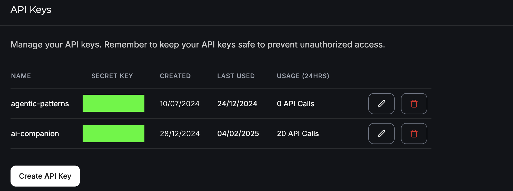
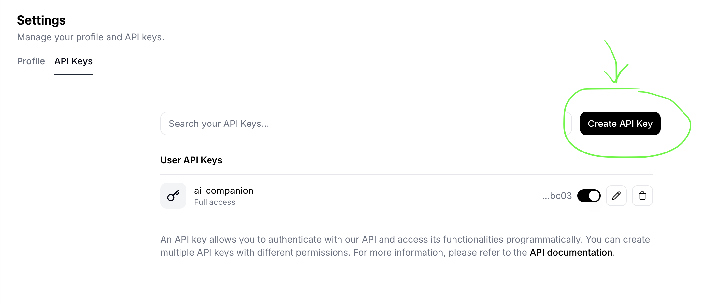
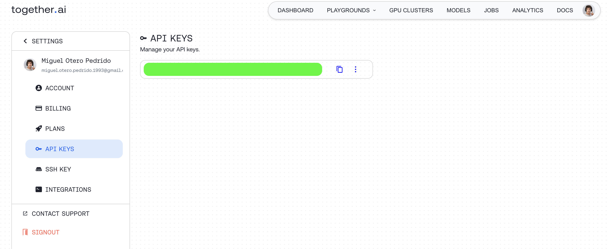
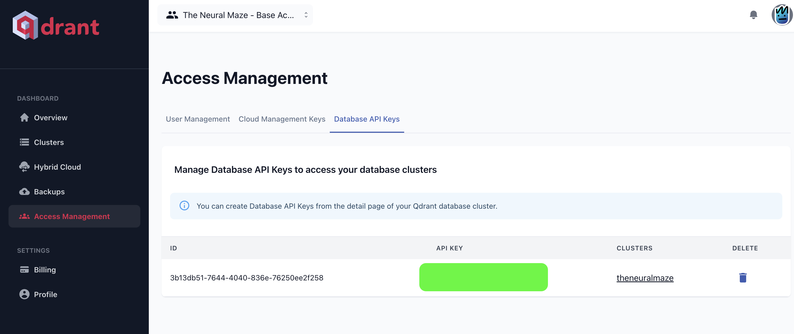
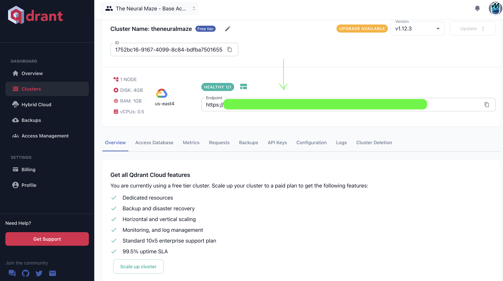

# UV Installation

Instead of `pip` or `poetry`, we are using `uv` as the Python package manager.

To install uv, simply follow this [instructions](https://docs.astral.sh/uv/getting-started/installation/).

Once uv is intalled, you can install the project dependencies by running:

> **Note:**: We recommend creating a virtual environment to avoid conflicts with your system Python.

```bash
uv sync
```

Now that all the dependencies are installed, it's time to populate the `.env` file with the correct values.

# Environment Variables

If you take a look at the `.env.example` file, you will see that there are a lot of variables that need to be set.

```
GROQ_API_KEY=""

ELEVENLABS_API_KEY=""
ELEVENLABS_VOICE_ID=""

TOGETHER_API_KEY=""

QDRANT_URL=""
QDRANT_API_KEY=""

WHATSAPP_PHONE_NUMBER_ID = ""
WHATSAPP_TOKEN = ""
WHATSAPP_VERIFY_TOKEN = ""
```

In this doc, we will show you how to get the values for all of these variables, except for the WhatsApp ones. That's something we will cover in a dedicated lesson. Let's begin.

### Groq

To create the GROQ_API_KEY, and be able to interact with Groq models, you just need to follow this [instructions](https://console.groq.com/docs/quickstart).



Once you have created the API key, you can copy it and paste it into an `.env` file (following the same format as the `.env.example` file).

### ElevenLabs

To create the ELEVENLABS_API_KEY you need to create an account in [ElevenLabs](https://elevenlabs.io/). After that, go to your account settings and create the API key.



As for the voice ID, you can check the Zazuilable voices and select the one you prefer! We'll cover this in a dedicated lesson.

### Together AI

Log in to [Together AI](https://www.together.ai/) and, inside your account settings, create the API key.



As we did with the previous API keys, copy the value and paste it into your own `.env` file.

### Qdrant

This project uses Qdrant both locally (you don't need to do anything) and in the cloud (you need to create an account in [Qdrant Cloud](https://login.cloud.qdrant.io/)).

Once you are inside the Qdrant Cloud dashboard, create your API key here:



You also need a QDRANT_URL, which is the URL of your Qdrant Cloud instance. You can find it here:



Copy both values and paste them into your own `.env` file.

This is everything you need to get the project up and running. Maybe you are wondering why we didn't set any of the WhatsApp variables. That's because you can still run the project without them, using the [Chainlit interface](../src/zazu_bot/interfaces/chainlit/app.py).

In Lesson 6 (the last one), we will cover, in detail, how to set up the WhatsApp interface.
